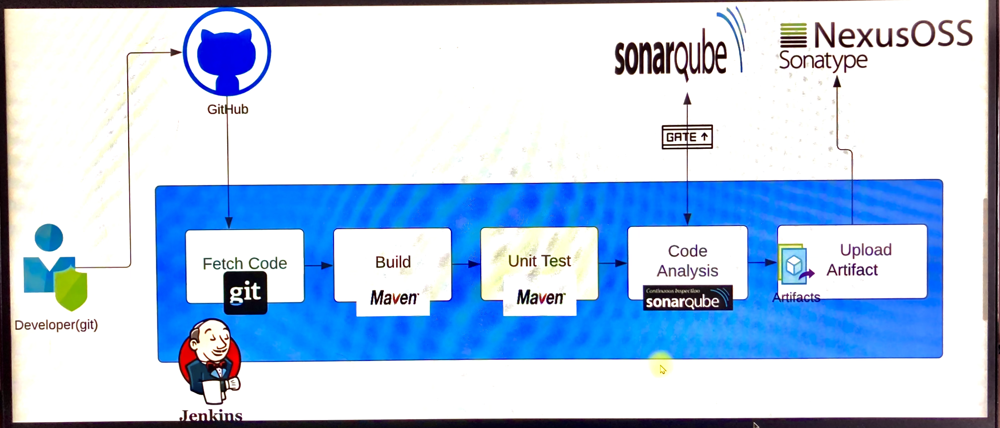
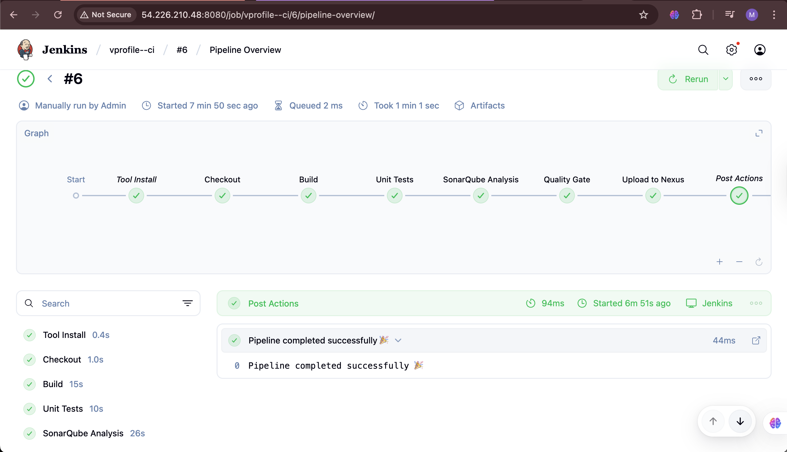
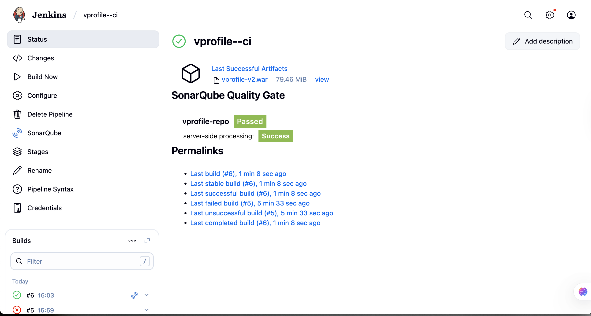
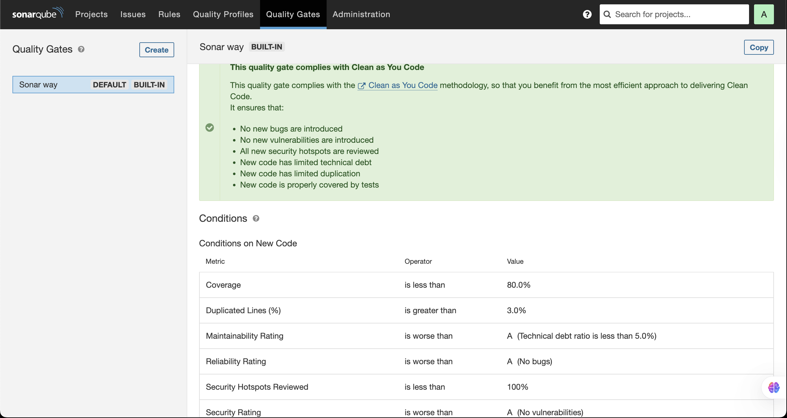
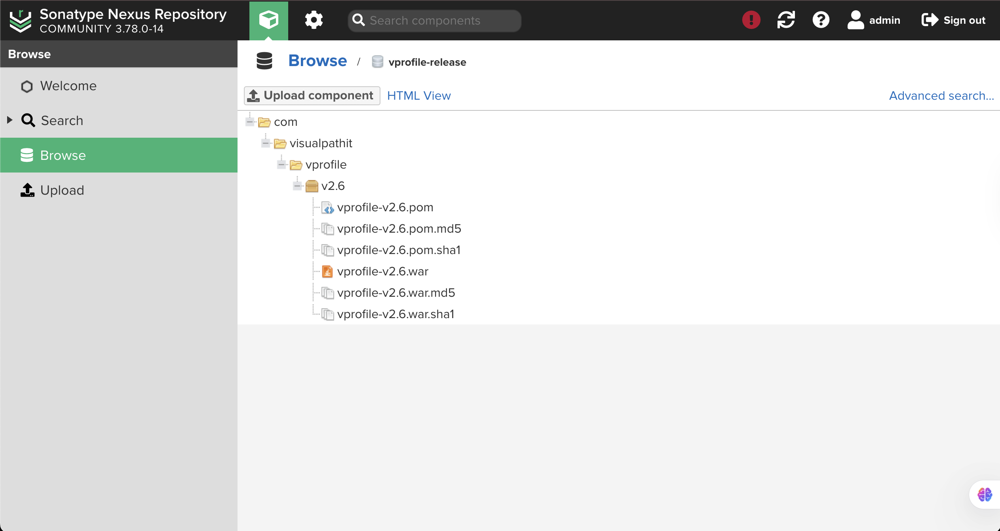
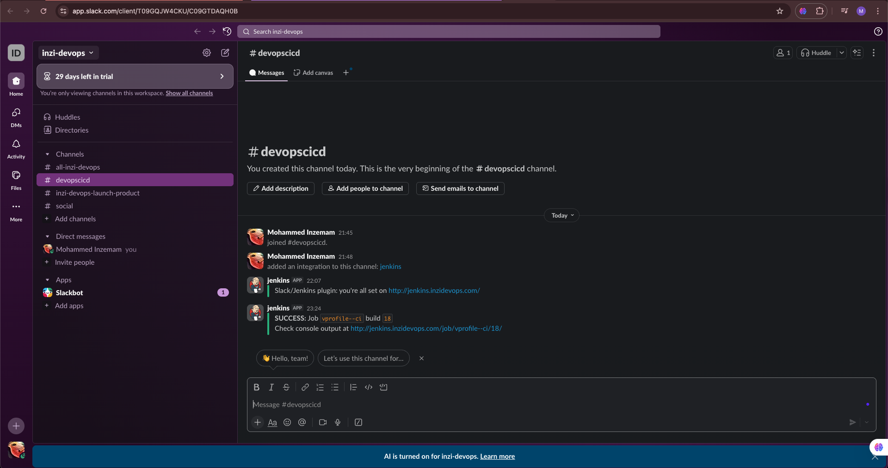

# 🚀 CI/CD Pipeline with Jenkins, SonarQube, Nexus & Slack

This project demonstrates a **real-world CI/CD pipeline** setup using **Jenkins, Git, Maven, SonarQube, Nexus OSS**, and **Slack notifications**.  

It is designed to showcase end-to-end DevOps practices similar to workflows in **FAANG-scale companies**, with full automation for **build, test, code analysis, artifact management, and team notifications**.

---

## 📌 Project Highlights
- ✅ **Automated pipeline** triggered by code commits  
- ✅ **Build & test** using Maven  
- ✅ **Static code analysis** & quality enforcement with SonarQube  
- ✅ **Artifact versioning** & publishing to Nexus repository  
- ✅ **Slack notifications** for pipeline status (success/failure)  
- ✅ Troubleshooting real-world issues (disk space, misconfigured IPs, failing quality gates)  

---

## 🛠️ Tools & Technologies
- **Jenkins** → CI/CD Orchestrator  
- **GitHub** → Source Code Repo  
- **Maven** → Build & Unit Testing  
- **SonarQube** → Static Code Analysis  
- **Nexus OSS** → Artifact Repository Manager  
- **Slack** → Notifications  
- **AWS EC2** → Infrastructure (Jenkins, SonarQube, Nexus servers)  

---

## 🌐 Architecture Overview



---

## ⚙️ Infrastructure Setup
- Jenkins → Amazon Linux 2023  
- Nexus → Amazon Linux 2023 (Port: 8081)  
- SonarQube → Ubuntu 24 (Port: 80/9000)  

---

## 🧩 Jenkins Pipeline Stages

1. **Source Code Checkout** → Pull code from GitHub  
2. **Build with Maven** → Compile & package `.war` file  
3. **Unit Test** → Execute test cases  
4. **SonarQube Analysis** → Static code analysis + Quality Gates  
5. **Upload to Nexus** → Store versioned artifacts  
6. **Slack Notifications** → Real-time build status updates  

---

## 📜 Jenkinsfile (Pipeline as Code)

```groovy
def COLOR_MAP(status) {
    if (status == 'SUCCESS') {
        return 'good'
    } else if (status == 'FAILURE') {
        return 'danger'
    }
}

pipeline {
    agent any

    tools {
        maven 'Maven'
        jdk 'JDK11'
    }

    stages {
        stage('Checkout') {
            steps {
                git branch: 'main', url: 'https://github.com/mohammedinzi/vprofile-devops.git'
            }
        }

        stage('Build with Maven') {
            steps {
                sh 'mvn clean install'
            }
        }

        stage('Unit Test') {
            steps {
                sh 'mvn test'
            }
        }

        stage('SonarQube Analysis') {
            steps {
                withSonarQubeEnv('SonarQubeServer') {
                    sh 'mvn sonar:sonar'
                }
            }
        }

        stage('Upload Artifact to Nexus') {
            steps {
                nexusArtifactUploader(
                    nexusVersion: 'nexus3',
                    protocol: 'http',
                    nexusUrl: 'http://<NEXUS_PRIVATE_IP>:8081',
                    groupId: 'com.vprofile',
                    version: "${env.BUILD_ID}-${env.BUILD_TIMESTAMP}",
                    repository: 'vprofile-repo',
                    credentialsId: 'nexus-login',
                    artifacts: [
                        [artifactId: 'vpro-app', classifier: '', file: 'target/vprofile-v2.war', type: 'war']
                    ]
                )
            }
        }
    }

    post {
        always {
            echo 'Slack Notification'
            slackSend(
                channel: '#devopscicd',
                color: COLOR_MAP(currentBuild.currentResult),
                message: "Job ${env.JOB_NAME} build ${env.BUILD_NUMBER} - ${currentBuild.currentResult}"
            )
        }
    }
}
````

---

## 🐛 Troubleshooting & Challenges

### 1. Jenkins Disk Space Issue

* Error: *“Waiting for next available executor”*
* Fix: Cleaned `/var/lib/jenkins/workspace` and restarted Jenkins

### 2. Wrong Nexus Private IP

* Uploads failed due to incorrect IP → fixed by updating pipeline config

### 3. SonarQube Quality Gate Failures

* Fixed vulnerabilities & code smells to pass gates

---

## 📸 Screenshots

* Jenkins Pipeline Overview
  

* Jenkins Build Success
  

* SonarQube Quality Gates
  

* Nexus Artifact Upload
  

* Slack Notifications
  

---

## 🔗 Repository

👉 [mohammedinzi/vprofile-devops](https://github.com/mohammedinzi/vprofile-devops.git)

---

## ✅ Key Takeaways

* Built a **production-grade CI/CD pipeline**
* Automated artifact versioning & Nexus publishing
* Enforced **code quality gates** using SonarQube
* Integrated **Slack notifications** for collaboration
* Solved **real-world DevOps challenges**

---
