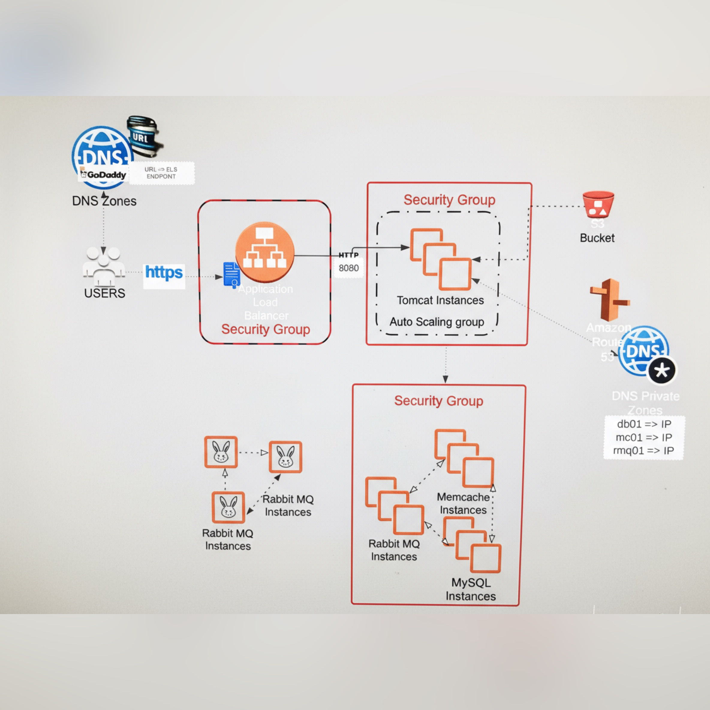

# 🚀 Lift & Shift — vProfile → AWS

This branch (`awsliftandshift`) migrates the **vProfile multi-tier application** from on-prem/Vagrant to **AWS IaaS** using EC2, Auto Scaling Groups, and Application Load Balancers.  
Provisioning is handled through **bash scripts** + EC2 User Data, replacing Vagrant provisioning.

---

## 📌 Architecture Overview


**Flow**  
User → Application Load Balancer (HTTP/HTTPS) → Auto Scaling Group (Tomcat EC2s)  
↓  
Private subnet backends → MySQL, Memcached, RabbitMQ  
↓  
S3 (artifacts) + Route 53 (private DNS) + IAM roles for secure access

---

## 🛠️ AWS Services Used
- **EC2** — App servers + backend services (MySQL, Memcached, RabbitMQ)  
- **Application Load Balancer** — Traffic distribution, HTTPS (ACM)  
- **Auto Scaling Group** — Scales app tier horizontally  
- **S3** — WAR artifact storage  
- **Route 53** — Private DNS resolution between tiers  
- **IAM Roles** — Secure access (EC2 → S3, etc.)  
- **CloudWatch** — Metrics, scaling triggers, health monitoring  

---

## 📂 Repository Structure

awsliftandshift/
├── ansible/ # Optional: config management
├── application.properties # App DB + middleware configs
├── backend.sh # MySQL bootstrap
├── memcache.sh # Memcached setup
├── mysql.sh # MySQL installation
├── rabbitmq.sh # RabbitMQ installation
├── al2023rmq.repo # RabbitMQ repo config
├── tomcat_ubuntu.sh # Tomcat + Java 17
├── nginx.sh # Nginx reverse proxy
├── userdata # EC2 User Data (bootstrap app)
├── Jenkinsfile # CI/CD pipeline
├── pom.xml # Maven build
├── src/ # Application source code
└── README.md # This documentation

yaml
Copy code

---

## ⚙️ What’s Implemented
- Bash provisioning scripts for **MySQL, Memcached, RabbitMQ, Tomcat, Nginx**  
- EC2 **User Data** → bootstrap app tier automatically  
- S3 → Artifact storage, deployed via scripts  
- Auto Scaling Group (ASG) + Target Group + ALB with stickiness  
- Session persistence → Required for login consistency across multiple EC2s  
- Secure SG design:  
  - ALB (80/443) → Tomcat (8080)  
  - Tomcat → MySQL (3306), RabbitMQ (5672), Memcached (11211)  
- Cleanup workflow (tier-1 practice): ASG → Launch Template → ALB → TG → AMIs/Snapshots → SGs → Route 53 → S3  

---

## 🚀 Quick Start

### 1️⃣ Build & Upload Artifact
```bash
mvn clean install
aws s3 cp target/vprofile-v2.war s3://<your-s3-bucket>/
2️⃣ Provision Infrastructure
Create Security Groups for DB, MQ, Cache, App, and ALB.

Launch backend services with scripts:

bash
Copy code
./mysql.sh
./memcache.sh
./rabbitmq.sh
Launch app EC2 with User Data (userdata).

Configure Nginx with nginx.sh.

3️⃣ Bake AMI & Launch Template
Create AMI from app01

Create Launch Template → attach SGs, keypair, tags

4️⃣ Create Auto Scaling Group
Min: 1, Desired: 1, Max: 4

Attach to Target Group → enable stickiness

5️⃣ Load Balancer
ALB with HTTP (80) / HTTPS (443) listeners

ACM cert for HTTPS

Health check on port 8080

🔑 Accessing the Application
ALB DNS Name → http://<alb-dns>

Login:

makefile
Copy code
username: admin_vp
password: admin_vp
🧹 Cleanup (Enterprise Practice)
Delete resources in order:

Auto Scaling Group

Launch Template & ALB

Target Group

EC2 Instances (if any remain)

Security Groups & Key Pairs

AMIs → delete Snapshots

Route 53 hosted zone records

Empty & delete S3 buckets

🎯 Key Takeaways
Full migration from Vagrant → AWS (IaaS)

Bash scripts + User Data replace provisioning tools

ASG + ALB provide scalability + HA

Enterprise cleanup ensures zero residual costs

Foundation for re-architecting into cloud-native AWS services (RDS, ElastiCache, Amazon MQ, ECS/EKS)


